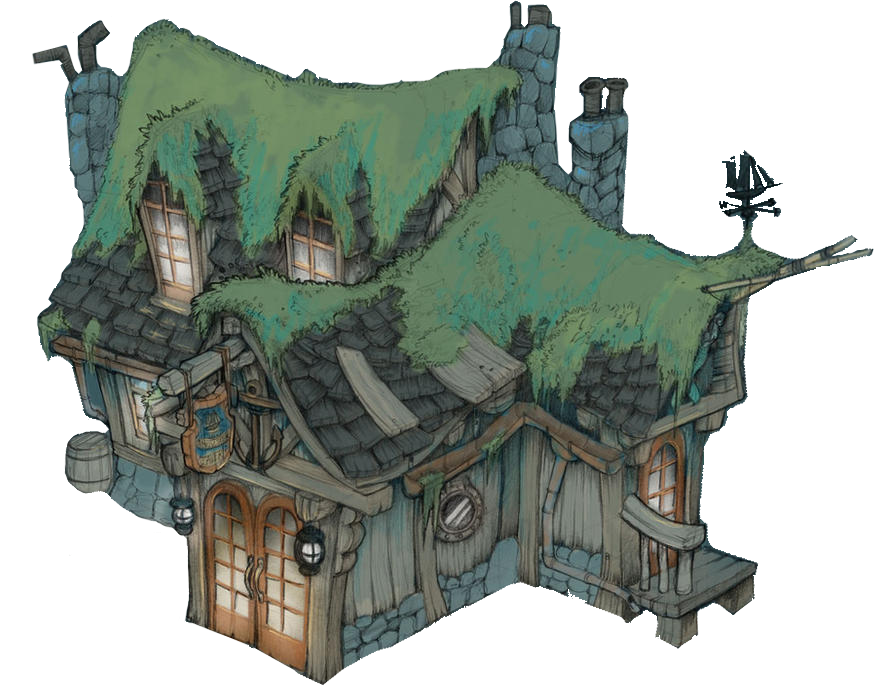

# La Taverne

<a href="https://www.npmjs.com/package/taverne"></a> <a href="https://www.npmjs.com/package/taverne"></a> <a href="https://reactjs.org/docs/hooks-custom.html"></a> <a href="https://immerjs.github.io/immer/docs/produce"> </a>

`La Taverne` is an elementary [Flux](https://facebook.github.io/flux/docs/in-depth-overview) implementation using and [`Immer`](https://github.com/immerjs/immer).

It provides an easy optional integration with React using custom **hooks**.

<p align="center"></p>


## 📦 installation

```sh
> npm i --save taverne
```

## 🎨 idea

- `Taverne` allows to organize your app State in one or many stores.
- You can listen to specific parts of specific stores, to allow accurate local rendering from your global app state (see the [advanced section](#-advanced-usage)).

```js
const ItemsContainer = props => {
  const {useItemsStore} = useTaverne();
  const {items} = useItemsStore();

  return <ItemsComponent items={items} />;
};
```

## 🔆 Reactions

Here is a `reaction`:

```js
const doSomethingInThisStore = {
  on: 'ACTION_TYPE',
  reduce: (state, payload) => {
    /*
      Just update the state with your payload.
      Here, `state` is the draftState used by `Immer.produce`
      You store will then record your next immutable state.
    */
    state.foo = 'bar';
  },
  perform: (parameters, getState, dispatch) => {
    /*
      Optional sync or async function.
      It will be called before `reduce`

      When it is done, reduce will receive the result in
      the `payload` parameter.

      You can `dispatch` next steps from here as well
    */
  }
};
```

- A `reaction` will be triggered when an action is dispatched with `action.type` === `on`.

- `reduce` is called using `Immer`, so mutate the `state` exactly as you would with the `draftState` parameter in [produce](https://immerjs.github.io/immer/docs/produce).

- If you have some business to do before reducing, for example calling an API, use the `perform` function, either `sync` or `async`.

  Then `reduce` will be called with the result once it's done.

## 📚 motivation

read this [doc](docs/motivation.md)

## 🏗️ development

[](https://david-dm.org/uralys/taverne?type=peer)
[](https://david-dm.org/uralys/taverne?type=dev)
[](https://david-dm.org/uralys/taverne)

local dev [tips](docs/dev.md)

## credits

tavern: <https://www.deviantart.com/brandonstarr/art/Colored-Pirate-Tavern-210784171>
